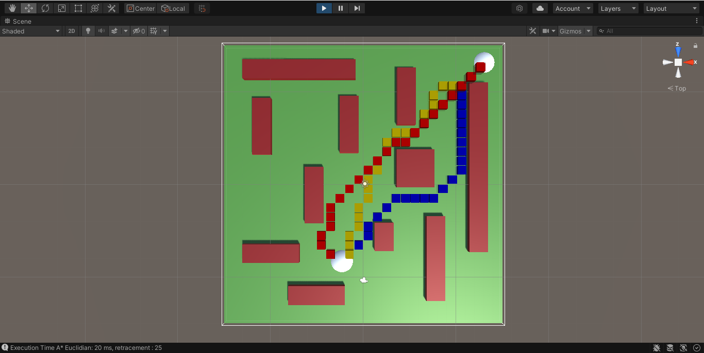
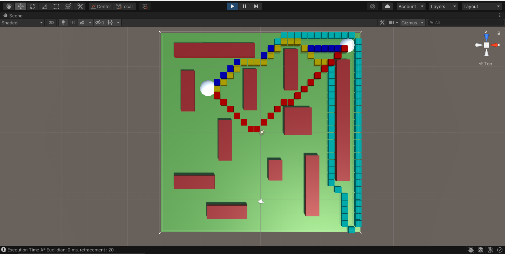
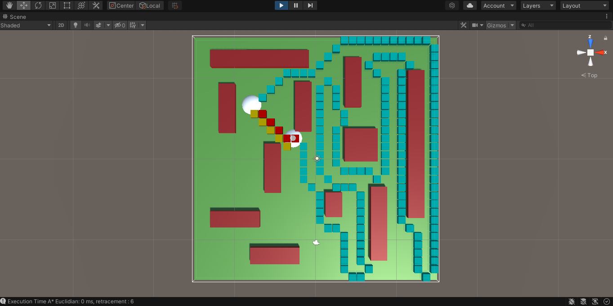
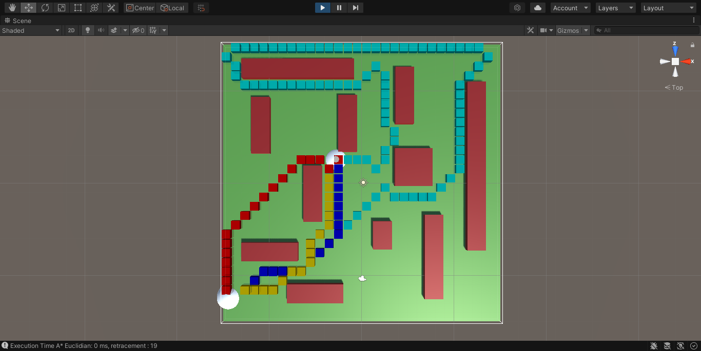
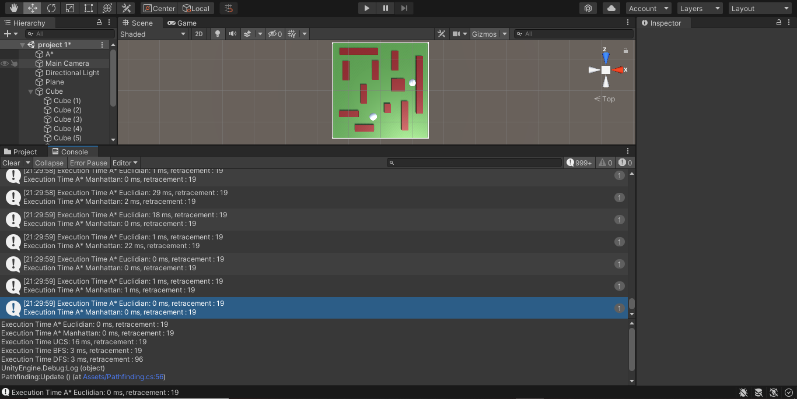

# AI-CSC4301-Search

## Description
In this project, we (@ahmedJaafari and I) will be reproducing the pathfinding project of @SebLague and experiment different search algorithms (A*, DFS, BFS, UCS) and heuristic strategies assuming these all have the same cost in all directions and A* with different heuristics.
While running this project using unity, you can see different paths found by each strategy simultaneously with different colours and the total time it takes each strategy.

## Youtube Video
My Youtube channel: https://www.youtube.com/watch?v=YB2iMI6nShw&t   
Click on the Image !

## Screenshots

## References
Sebastian Lague Youtube channel: https://www.youtube.com/watch?v=-L-WgKMFuhE&list=PLFt_AvWsXl0cq5Umv3pMC9SPnKjfp9eGW   
Github course code: https://github.com/SebLague/Pathfinding  
